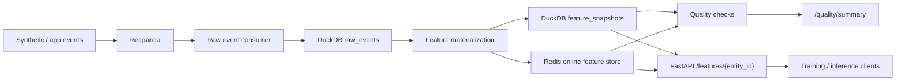

# streaming-feature-platform

An end-to-end feature platform that ingests event streams, materializes online and offline features, reconciles consistency under streaming updates, serves low-latency feature reads, exposes operational metrics for downstream ML systems, and generates local GCP Pub/Sub and BigQuery dry-run assets from the same deterministic event stream.

This repo focuses on a production failure mode that directly affects ranking, recommendation, and inference systems: stale or inconsistent features reaching training and online scoring paths at different times.

## Problem

Feature platforms are useful only when the same feature logic can be trusted in three places at once:

- streaming ingestion and feature updates
- online serving for low-latency reads
- offline snapshots for training, backfills, and debugging

When any one of those paths drifts, teams get training-serving skew, brittle experiments, and silent regressions in production models.

## Architecture



Operationally, the repo has two execution modes:

1. full local stack with Redpanda, Redis, DuckDB, and FastAPI
2. hosted demo mode that bootstraps deterministic sample events and serves the same read-only API surface without provisioning the entire stream

## Capabilities

This repo supports:

- event production into Redpanda
- raw event persistence in DuckDB
- feature materialization into DuckDB and Redis
- online feature serving through FastAPI
- offline training-dataset export from the latest snapshot plus event-derived labels
- schema compatibility checks and freshness/reconciliation validation
- Prometheus-style metrics at `GET /metrics`
- local GCP Pub/Sub and BigQuery dry-run assets generated from the deterministic demo stream
- `GET /gcp/readiness` for generating and inspecting the local GCP bundle from the API surface

## Run Steps

### Full local stack

```bash
make setup
make up
make produce
make consume
make materialize
make export-training
make test
```

### Hosted demo mode

For the hosted-demo code path, use:

```bash
HOSTED_DEMO=1 make serve
```

That path bootstraps deterministic events, materializes offline features, and serves:

- `GET /`
- `GET /health`
- `GET /features/{entity_id}`
- `GET /quality/summary`
- `GET /training-dataset/summary`
- `GET /gcp/readiness`
- `GET /metrics`

### GCP dry-run assets

Generate the Pub/Sub and BigQuery dry-run bundle locally without any Google credentials:

```bash
make gcp-dry-run
```

That writes a reproducible asset bundle under `data/generated/gcp/`:

- `pubsub_topic.json`
- `pubsub_messages.jsonl`
- `bigquery_raw_events.sql`
- `bigquery_feature_snapshots.sql`
- `bigquery_raw_events.jsonl`
- `bigquery_feature_snapshots.jsonl`
- `dry_run_summary.json`

The dry-run path is local-only. It does not call Pub/Sub or BigQuery APIs, but it does generate the exact message envelope, table DDL, and row shapes that the repo would publish and load in GCP.

### Browser endpoints

- `http://localhost:8010/`
- `http://localhost:8010/features/user_0001`
- `http://localhost:8010/quality/summary`
- `http://localhost:8010/training-dataset/summary`
- `http://localhost:8010/gcp/readiness`
- `http://localhost:8010/metrics`

## Repo Layout

```text
streaming-feature-platform/
├── docs/
├── data/
├── infra/
├── src/
│   ├── connectors/
│   ├── pipelines/
│   ├── features/
│   ├── quality/
│   └── serving/
└── tests/
```

## Stack

- Python 3.11+
- Redpanda or Kafka
- Redis
- DuckDB
- PostgreSQL
- FastAPI
- Pydantic
- Docker Compose
- pytest
- Prometheus metrics
- GCP Pub/Sub and BigQuery dry-run assets

## Prerequisites

Recommended local setup:

```bash
git clone https://github.com/srn91/streaming-feature-platform.git
cd streaming-feature-platform
python3.12 -m pip install -r requirements.txt
open -a Docker
```

Wait until Docker Desktop is fully started before running `docker compose`.

If your machine has multiple Python versions and one of them causes package build problems, use Python 3.12 explicitly:

```bash
git clone https://github.com/srn91/streaming-feature-platform.git
cd streaming-feature-platform
python3.12 -m venv .venv
source .venv/bin/activate
python -m pip install --upgrade pip
python -m pip install -r requirements.txt
```

## Local API

```bash
make serve
```

API will be exposed at:

`http://localhost:8010`

## Cloud and Infrastructure Assets

The repo includes deployment and operations assets for the shipped local and hosted demo paths, plus a concrete GCP handoff lane:

- `Dockerfile` for a single-container FastAPI deployment
- `docker-compose.yml` for the local multi-service stack
- `infra/kubernetes/` for a small Deployment + Service + ConfigMap
- `infra/gcp/` for Cloud Run, Pub/Sub topic, and BigQuery schema assets
- `infra/observability/prometheus.yml` for scraping `/metrics`
- `data/generated/gcp/` for the local GCP Pub/Sub and BigQuery dry-run bundle

These assets are intentionally scoped to the read-only demo and local developer paths. The full local developer stack still uses Docker Compose with Redpanda and Redis.

## Hosted Deployment

- Live URL: [https://streaming-feature-platform-demo.onrender.com](https://streaming-feature-platform-demo.onrender.com)
- First path to open: `/quality/summary`
- Browser smoke result: after the initial Render wake-up, `/quality/summary` loaded in a real browser and returned the live raw-event, feature-snapshot, freshness, and reconciliation payload.
- First direct API checks that returned `200` after wake-up:
  - `/health`
  - `/features/user_0001`
  - `/quality/summary`

This hosted service is intentionally a read-only demo mode. It seeds deterministic sample events, materializes feature snapshots into DuckDB, and serves the same FastAPI endpoints as the local stack without provisioning Redpanda or Redis.

Browser-friendly endpoints:

- `http://localhost:8010/`
- `http://localhost:8010/health`
- `http://localhost:8010/features/user_0001`
- `http://localhost:8010/quality/summary`
- `http://localhost:8010/training-dataset/summary`
- `http://localhost:8010/metrics`

## Validation

The repo verifies:

- raw event volume and entity coverage
- latest feature snapshot coverage
- schema version enforcement
- duplicate and null-field validation
- freshness lag and online/offline reconciliation
- training-dataset export from the latest offline snapshot plus purchase labels
- local GCP Pub/Sub and BigQuery dry-run asset generation
- Prometheus metrics emission for API traffic, quality summaries, and training-dataset exports

Local quality gates:

- `ruff check src tests`
- `pytest tests`
- `make test`

To run the tests:

```bash
make test
```

If dependency installation fails:

- this milestone does not require Postgres client libraries yet
- the current runnable path uses Redpanda, DuckDB, Redis, FastAPI, and the local GCP dry-run exporter
- use the updated `requirements.txt` and install again

Render deployment notes:

- build command: `python3 -m pip install -r requirements.txt`
- start command: `HOSTED_DEMO=1 make serve`
- health check path: `/health`
- Python runtime is pinned with `.python-version` so Render builds this service on Python `3.12.x`
- the hosted demo is read-only and artifact-backed
- the hosted demo uses deterministic fixtures, so the output is stable across redeploys
- the hosted reconciliation section is expected to report Redis as skipped, because the hosted demo does not provision the online store
- the hosted quality summary includes schema compatibility details so you can inspect which schema versions were accepted or rejected

Key env knobs:

- `SUPPORTED_SCHEMA_VERSIONS`
- `FRESHNESS_WARNING_LAG_SECONDS`
- `FRESHNESS_ERROR_LAG_SECONDS`
- `GCP_PROJECT_ID`
- `GCP_PUBSUB_TOPIC`
- `GCP_BIGQUERY_DATASET`
- `GCP_BIGQUERY_RAW_EVENTS_TABLE`
- `GCP_BIGQUERY_FEATURE_SNAPSHOTS_TABLE`
- `GCP_ASSET_OUTPUT_DIR`

If a local data file becomes corrupted after an interrupted run:

```bash
make clean-data
```

Then rerun:

```bash
make produce
make consume
make materialize
make export-training
```
