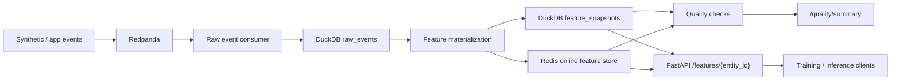

# streaming-feature-platform

An end-to-end feature platform that ingests event streams, materializes online and offline features, reconciles consistency under streaming updates, and serves low-latency features to downstream ML systems.

This project focuses on a real production failure mode: stale, inconsistent, or schema-broken features reaching training and inference systems. When online and offline feature values drift apart, teams get bad predictions, misleading experiments, and hard-to-debug regressions in production.

## Production Problem

The real problem is keeping online and offline feature values aligned while the source data is still changing.

This repo shows that operational loop in a concrete way:

- stream events into Redpanda
- materialize the same feature logic into DuckDB and Redis
- compare freshness, schema compatibility, and reconciliation
- expose a serving API that downstream inference clients can trust

## Hosted demo mode

Render runs this repo in `HOSTED_DEMO=1` mode.

In that mode the app:

- seeds deterministic sample events from local fixtures at startup
- materializes offline feature snapshots into DuckDB
- serves the existing read-only FastAPI endpoints
- does not require a live Redpanda or Redis stack

That keeps the hosted demo honest: it shows the platform outputs, not the entire local infrastructure.

## Project goals

By the end of this project, the repo should demonstrate:

1. event ingestion through Kafka or Redpanda
2. streaming feature computation
3. offline feature generation for training and backfills
4. online feature serving through Redis
5. dataset and feature quality checks
6. schema compatibility handling
7. a simple consumer service that reads features for inference
8. observability for freshness, latency, and data drift

## Target architecture



See [docs/architecture.md](docs/architecture.md) for the detailed system design.

Operationally, the flow is:

1. application or synthetic events arrive
2. Redpanda buffers the stream
3. a consumer writes raw events into DuckDB
4. feature materialization updates offline snapshots and the Redis online store
5. quality checks compare freshness and online/offline consistency
6. FastAPI serves the latest feature state to clients

## Current status

This repo already runs end to end locally:

- synthetic events are published into Redpanda
- raw events are persisted into DuckDB
- feature snapshots are materialized into offline and online stores
- FastAPI serves feature lookup and quality status
- a training dataset export is produced from the latest offline snapshot plus event-derived labels
- validation, schema compatibility, freshness, and online/offline reconciliation are exposed through the API

The most portable local run sequence is:

```bash
make setup
make up
make produce
make consume
make materialize
make export-training
make test
```

That is the path a reviewer should use on any laptop with Docker and Python installed.

For the Render-hosted demo, use:

```bash
HOSTED_DEMO=1 make serve
```

That path bootstraps deterministic events, materializes offline features, and serves:

- `GET /`
- `GET /health`
- `GET /features/{entity_id}`
- `GET /quality/summary`
- `GET /training-dataset/summary`

Current browser endpoints:

- `http://localhost:8010/`
- `http://localhost:8010/features/user_0001`
- `http://localhost:8010/quality/summary`
- `http://localhost:8010/training-dataset/summary`

## Repo structure

```text
streaming-feature-platform/
├── docs/
├── data/
├── infra/
├── src/
│   ├── connectors/
│   ├── pipelines/
│   ├── features/
│   ├── quality/
│   └── serving/
└── tests/
```

## Project docs

For more detail:

1. [docs/architecture.md](docs/architecture.md)
2. [docs/learning-roadmap.md](docs/learning-roadmap.md)
3. [docs/milestones.md](docs/milestones.md)

## Initial tech stack

- Python 3.11+
- Redpanda or Kafka
- Redis
- DuckDB
- PostgreSQL
- FastAPI
- Pydantic
- Docker Compose
- pytest

Optional later:

- Spark Structured Streaming
- dbt
- Great Expectations or Soda
- Prometheus + Grafana

## Prerequisites

Before running the project locally:

1. install Python dependencies
2. make sure Docker Desktop is running
3. prefer Python 3.12 or 3.13 for local setup

Recommended commands:

```bash
git clone https://github.com/srn91/streaming-feature-platform.git
cd streaming-feature-platform
python3.12 -m pip install -r requirements.txt
open -a Docker
```

Wait until Docker Desktop is fully started before running `docker compose`.

Before running the hosted demo on Render:

1. use the blueprint in [`render.yaml`](render.yaml)
2. set `HOSTED_DEMO=1`
3. keep the start command as `make serve`
4. do not provision Redpanda or Redis for the hosted service

If your machine has multiple Python versions and one of them causes package build problems, use Python 3.12 explicitly:

```bash
git clone https://github.com/srn91/streaming-feature-platform.git
cd streaming-feature-platform
python3.12 -m venv .venv
source .venv/bin/activate
python -m pip install --upgrade pip
python -m pip install -r requirements.txt
```

## Quick start

```bash
git clone https://github.com/srn91/streaming-feature-platform.git
cd streaming-feature-platform
make setup
make up
make produce
make consume
make materialize
make export-training
```

`make setup` is pinned to Python 3.12 so the native `duckdb` and `confluent-kafka` wheels install cleanly on a reviewer laptop.

API will be exposed at:

`http://localhost:8010`

On Render, the same API is exposed on the service URL Render assigns.

## Hosted Deployment

- Live URL: [https://streaming-feature-platform-demo.onrender.com](https://streaming-feature-platform-demo.onrender.com)
- First path to open: `/quality/summary`
- Browser smoke result: after the initial Render wake-up, `/quality/summary` loaded in a real browser and returned the live raw-event, feature-snapshot, freshness, and reconciliation payload.
- First direct API checks that returned `200` after wake-up:
  - `/health`
  - `/features/user_0001`
  - `/quality/summary`

This hosted service is intentionally a read-only demo mode. It seeds deterministic sample events, materializes feature snapshots into DuckDB, and serves the same FastAPI endpoints as the local stack without provisioning Redpanda or Redis.

Browser-friendly endpoints:

- `http://localhost:8010/`
- `http://localhost:8010/health`
- `http://localhost:8010/features/user_0001`
- `http://localhost:8010/quality/summary`
- `http://localhost:8010/training-dataset/summary`

Quality checks currently include:

- raw event volume and entity coverage
- historical feature row count versus latest snapshot coverage
- supported schema version enforcement
- explicit schema compatibility reporting with accepted and rejected versions
- duplicate and null-field validation
- freshness lag with configurable warning and error thresholds
- online/offline reconciliation against Redis
- training-dataset export built from the latest offline snapshot plus purchase labels from raw events

To run the tests:

```bash
make test
```

If Docker is not running:

- the producer and consumer will not be able to connect to Redpanda
- feature materialization will run, but it will show `0 feature snapshots` if no raw events were successfully ingested first

If dependency installation fails:

- this milestone does not require Postgres client libraries yet
- the current runnable path uses Redpanda, DuckDB, Redis, and FastAPI
- use the updated `requirements.txt` and install again

Render deployment notes:

- build command: `python3 -m pip install -r requirements.txt`
- start command: `HOSTED_DEMO=1 make serve`
- health check path: `/health`
- Python runtime is pinned with `.python-version` so Render builds this service on Python `3.12.x`
- the hosted demo is read-only and artifact-backed
- the hosted demo uses deterministic fixtures, so the output is stable across redeploys
- the hosted reconciliation section is expected to report Redis as skipped, because the hosted demo does not provision the online store
- the hosted quality summary includes schema compatibility details so reviewers can see exactly which schema versions were accepted or rejected

Key env knobs:

- `SUPPORTED_SCHEMA_VERSIONS`
- `FRESHNESS_WARNING_LAG_SECONDS`
- `FRESHNESS_ERROR_LAG_SECONDS`

If a local data file becomes corrupted after an interrupted run:

```bash
make clean-data
```

Then rerun:

```bash
make produce
make consume
make materialize
make export-training
```
