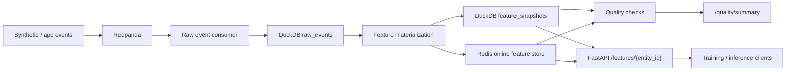

# streaming-feature-platform

A production-style data platform that ingests event streams, computes online and offline features, validates feature consistency, and serves low-latency features for downstream ML systems.

## Why this project exists

This project is designed to match what current hiring teams screen for in:

- Data Engineering
- Machine Learning Engineering
- AI / ML platform roles

It is intentionally built around the kinds of problems that show up in modern data platform work:

- streaming ingestion
- batch backfills
- online and offline feature consistency
- schema evolution
- data quality and reconciliation
- feature freshness and serving reliability

## Project goals

By the end of this project, the repo should demonstrate:

1. event ingestion through Kafka or Redpanda
2. streaming feature computation
3. offline feature generation for training and backfills
4. online feature serving through Redis
5. dataset and feature quality checks
6. schema compatibility handling
7. a simple consumer service that reads features for inference
8. observability for freshness, latency, and data drift

## Target architecture



See [docs/architecture.md](/Users/sathwikraonadipelli/Desktop/RESUMES/projects/streaming-feature-platform/docs/architecture.md) for the detailed system design.

## Current status

This repo already runs end to end locally:

- synthetic events are published into Redpanda
- raw events are persisted into DuckDB
- feature snapshots are materialized into offline and online stores
- FastAPI serves feature lookup and quality status
- validation, freshness, and online/offline reconciliation are exposed through the API

Current browser endpoints:

- `http://localhost:8010/`
- `http://localhost:8010/features/user_0001`
- `http://localhost:8010/quality/summary`

## Repo structure

```text
streaming-feature-platform/
├── docs/
├── data/
├── infra/
├── src/
│   ├── connectors/
│   ├── pipelines/
│   ├── features/
│   ├── quality/
│   └── serving/
└── tests/
```

## Learning-first build plan

This project is being built so that you can both:

- show it on GitHub
- explain it clearly in interviews

Start here:

1. [docs/learning-roadmap.md](/Users/sathwikraonadipelli/Desktop/RESUMES/projects/streaming-feature-platform/docs/learning-roadmap.md)
2. [docs/milestones.md](/Users/sathwikraonadipelli/Desktop/RESUMES/projects/streaming-feature-platform/docs/milestones.md)
3. [docs/interview-guide.md](/Users/sathwikraonadipelli/Desktop/RESUMES/projects/streaming-feature-platform/docs/interview-guide.md)

## Initial tech stack

- Python 3.11+
- Redpanda or Kafka
- Redis
- DuckDB
- PostgreSQL
- FastAPI
- Pydantic
- Docker Compose
- pytest

Optional later:

- Spark Structured Streaming
- dbt
- Great Expectations or Soda
- Prometheus + Grafana

## Prerequisites

Before running the project locally:

1. install Python dependencies
2. make sure Docker Desktop is running
3. prefer Python 3.12 or 3.13 for local setup

Recommended commands:

```bash
cd /Users/sathwikraonadipelli/Desktop/RESUMES/projects/streaming-feature-platform
python3 -m pip install -r requirements.txt
open -a Docker
```

Wait until Docker Desktop is fully started before running `docker compose`.

If your machine has multiple Python versions and one of them causes package build problems, use Python 3.12 explicitly:

```bash
/usr/local/bin/python3.12 -m venv .venv
source .venv/bin/activate
python -m pip install --upgrade pip
python -m pip install -r requirements.txt
```

## Quick start

```bash
cd /Users/sathwikraonadipelli/Desktop/RESUMES/projects/streaming-feature-platform
make setup
make up
make produce
make consume
make materialize
```

API will be exposed at:

`http://localhost:8010`

Browser-friendly endpoints:

- `http://localhost:8010/`
- `http://localhost:8010/health`
- `http://localhost:8010/features/user_0001`
- `http://localhost:8010/quality/summary`

Quality checks currently include:

- raw event volume and entity coverage
- historical feature row count versus latest snapshot coverage
- supported schema version enforcement
- duplicate and null-field validation
- freshness lag with configurable warning and error thresholds
- online/offline reconciliation against Redis

To run the tests:

```bash
make test
```

If Docker is not running:

- the producer and consumer will not be able to connect to Redpanda
- feature materialization will run, but it will show `0 feature snapshots` if no raw events were successfully ingested first

If dependency installation fails:

- this milestone does not require Postgres client libraries yet
- the current runnable path uses Redpanda, DuckDB, Redis, and FastAPI
- use the updated `requirements.txt` and install again

Key env knobs:

- `SUPPORTED_SCHEMA_VERSIONS`
- `FRESHNESS_WARNING_LAG_SECONDS`
- `FRESHNESS_ERROR_LAG_SECONDS`

If a local data file becomes corrupted after an interrupted run:

```bash
make clean-data
```

Then rerun:

```bash
make produce
make consume
make materialize
```

## First implementation scope

Version 1 should be small but real:

- generate synthetic product or user events
- ingest them into Redpanda
- compute a few rolling features
- write online features into Redis
- write offline features into DuckDB or Parquet
- expose a `/features/{entity_id}` API
- run a reconciliation job between online and offline values

## Sample feature ideas

- 1h click count
- 24h session count
- rolling purchase value
- last active timestamp
- ratio of clicks to impressions
- category affinity score

## What will make this repo impressive

- a clear architecture diagram
- a working local stack with Docker Compose
- readable code and typed models
- explicit data quality checks
- a reconciliation report
- a crisp README with screenshots and tradeoffs

## How to explain this project

Use this short version first:

`I built a production-style streaming feature platform that ingests events through Redpanda, stores raw data in DuckDB, materializes online and offline features, serves low-latency lookups through Redis and FastAPI, and validates freshness plus online/offline consistency.`

Then expand on three points:

1. `Why it matters`
   This project is about avoiding training-serving skew and proving that feature values are trustworthy, not just moving data from one place to another.
2. `What makes it production-style`
   It includes schema-version checks, duplicate/null validation, freshness thresholds, historical versus latest snapshot reporting, and reconciliation between Redis and DuckDB.
3. `How I would scale it`
   The local version uses Python, Redpanda, Redis, and DuckDB for fast iteration, but the same design can evolve into Spark/Flink, Parquet/lakehouse storage, orchestration, and observability in production.

## Interview prompts

Be ready to answer these quickly:

1. What is training-serving skew, and how does this repo reduce it?
2. Why keep both online and offline feature stores?
3. What happens when an event schema changes?
4. Why do `total_feature_snapshots` and `latest_snapshot_entities` differ?
5. What would you replace first if this had to handle much higher throughput?

## Next step

Implement Milestone 1:

- local stack
- sample events
- schema definitions
- ingestion path
