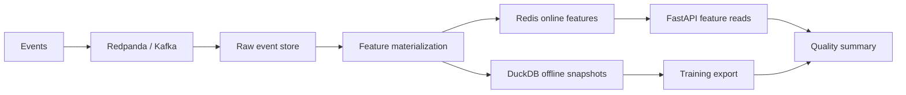

# Streaming Feature Platform - System Brief

## Problem

Feature pipelines need to keep streaming updates, online serving, and offline training snapshots consistent. This project demonstrates an end-to-end feature path with event ingestion, materialization, online reads, offline export, quality checks, metrics, and local GCP dry-run assets.

## System Design



## Stack

- Python, FastAPI, pytest
- Redpanda/Kafka-compatible ingestion
- DuckDB, Redis, Prometheus-style metrics
- Local Pub/Sub and BigQuery dry-run assets

## Metrics

- `192` deterministic demo events
- `12` distinct entities
- Freshness, schema compatibility, duplicate/null checks
- Prometheus-style metrics for API and data quality paths

## Run

```bash
make setup
make up
make produce
make consume
make materialize
make test
```

Hosted demo mode:

```bash
HOSTED_DEMO=1 make serve
```

Live demo: https://streaming-feature-platform-demo.onrender.com

## Production Scale Improvements

- Move offline features to a warehouse or lakehouse table with partitioned backfills.
- Add feature ownership metadata and freshness SLOs per feature group.
- Replace local Redis with managed online serving infrastructure.
- Add CI checks for feature schema compatibility before deployment.
